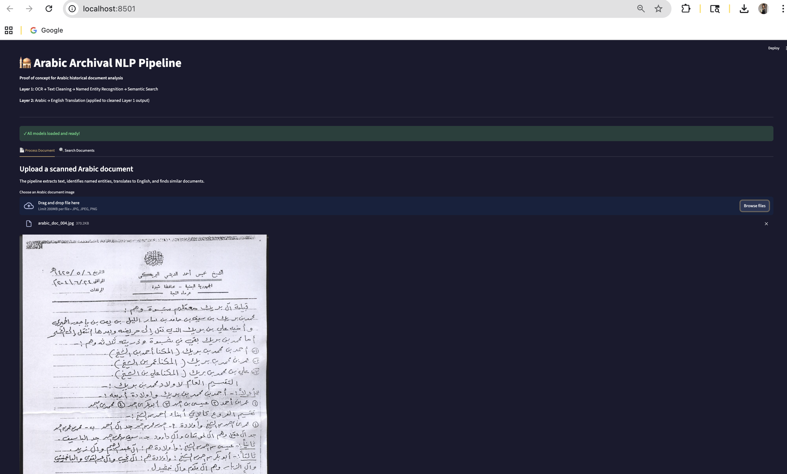
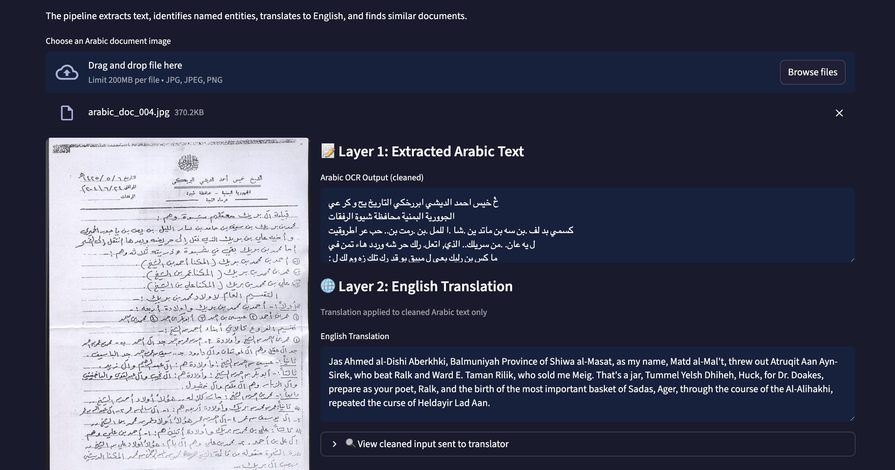
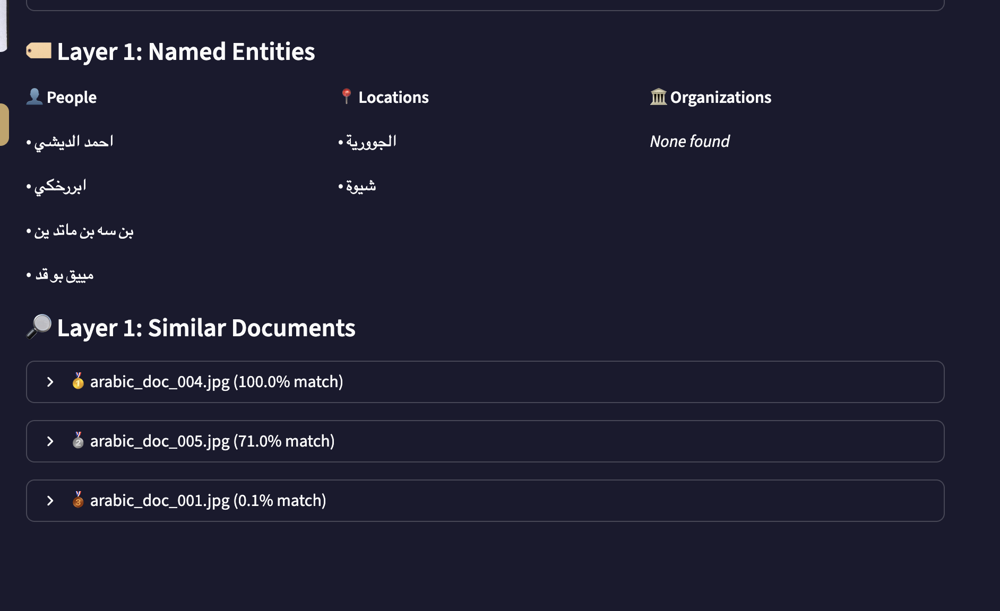
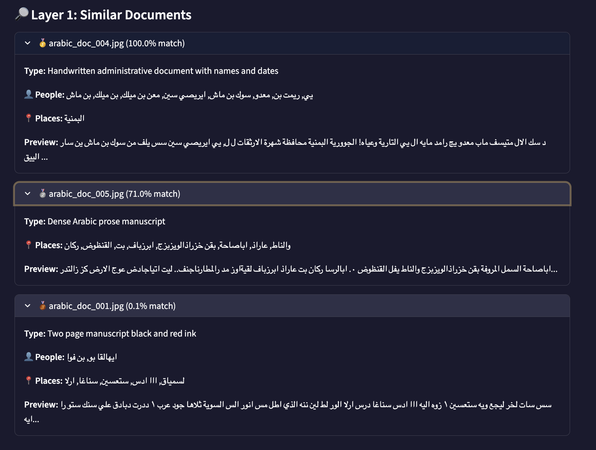

# 🕌 Arabic Archival NLP Pipeline

A proof of concept end-to-end NLP pipeline for Arabic historical document analysis, built to demonstrate computational approaches to making Arabic archival materials accessible to English-speaking researchers.

## Motivation

Arabic historical archives contain invaluable records that remain inaccessible to most researchers due to language barriers and the challenges of digitizing handwritten Arabic documents. This pipeline addresses the core problem: how do you take a scanned Arabic historical document and make it searchable, translatable, and connected to other records?

The architecture is directly motivated by the challenge of making Arabic expedition diaries and field notes, such as those written by Egyptian workers during early 20th century excavations at Giza, accessible to English-speaking researchers and connectable to existing English-language archive records.

## Pipeline Architecture

Scanned Document Image
↓
Layer 1: OCR (Tesseract + Arabic language pack)
↓
Layer 1: Text Cleaning (Arabic normalization, noise removal)
↓
Layer 1: Named Entity Recognition (CAMeL Tools AraBERT)
↓         ↓
Persons    Locations    Organizations
↓
Layer 1: Semantic Search (sentence-transformers + ChromaDB)
↓
Layer 2: Arabic to English Translation (Helsinki-NLP opus-mt-ar-en)
↓
Knowledge Graph (NetworkX)
**Layer 1** handles the core NLP work entirely in Arabic. It does not depend on translation.

**Layer 2** adds English accessibility on top of the cleaned Layer 1 output, making the archive accessible to non-Arabic readers.

## Demo Screenshots

### Full Interface: Upload and Process


### Layer 1: Arabic OCR and Layer 2: English Translation


### Layer 1: Named Entity Recognition
People, locations, and organizations extracted directly from Arabic text using CAMeL Tools AraBERT NER model.



### Layer 1: Semantic Search
Multilingual semantic search using sentence-transformers. English or Arabic queries return ranked results with entity metadata.



## Tech Stack

| Component | Tool |
|---|---|
| OCR | Tesseract 5.5 with Arabic language pack |
| Text cleaning | Custom Arabic normalization pipeline |
| NER | CAMeL Tools AraBERT (trained on Arabic text) |
| Semantic search | sentence-transformers multilingual-MiniLM-L12-v2 |
| Vector database | ChromaDB |
| Translation | Helsinki-NLP opus-mt-ar-en |
| Knowledge graph | NetworkX |
| Web interface | Streamlit |
| Language | Python 3.9 |

## Sample Output

Input: Scanned Arabic administrative document (arabic_doc_004)

**Named entities extracted:**
- People: احمد الديشي, ابررخكي, بن سه بن ماتد بن
- Locations: الجوورية, شيوة

**English translation:**
"Jas Ahmed al-Dishi Aberkhki, Balmuniyah Province of Shiwa al-Masat..."

**Semantic search:** Returns ranked similar documents with entity metadata attached.

## Running Locally

```bash
# Clone the repository
git clone https://github.com/Juhij2/arabic-archival-nlp.git
cd arabic-archival-nlp

# Install dependencies
pip install -r requirements.txt

# Install system dependencies (Mac)
brew install tesseract
brew install tesseract-lang

# Download CAMeL NER model
camel_data -i ner-arabert

# Run the app
streamlit run demo.py
```

## Repository Structure
arabic-archival-nlp/
├── data/
│   ├── raw_images/        # Source document scans
│   ├── ocr_output/        # Raw OCR results
│   ├── cleaned_text/      # Cleaned Arabic text
│   ├── entities/          # Extracted entities
│   └── knowledge_graph/   # Graph data and visualizations
├── notebooks/
│   ├── 01_ocr_pipeline.ipynb
│   ├── 02_text_cleaning.ipynb
│   ├── 03_ner_pipeline.ipynb
│   ├── 04_semantic_search.ipynb
│   └── 05_knowledge_graph.ipynb
├── screenshots/           # Demo screenshots
├── demo.py                # Streamlit web interface
├── packages.txt           # System dependencies
└── requirements.txt       # Python dependencies
## Key Design Decisions

**Why CAMeL Tools AraBERT for NER?** CAMeL Tools was built specifically for Arabic NLP and includes a NER model trained on Arabic text. Generic multilingual models perform poorly on Arabic historical documents.

**Why Helsinki-NLP for translation?** The opus-mt-ar-en model is trained specifically for Arabic to English translation and runs locally without API costs or rate limits.

**Why translation as Layer 2, not Layer 1?** Translating raw OCR output directly produces poor results because OCR errors compound during translation. Cleaning and structuring the Arabic text first, then translating, produces significantly better output.

**Why ChromaDB for semantic search?** ChromaDB enables meaning-based search rather than keyword matching. A researcher can search in English and retrieve relevant Arabic documents based on semantic similarity.

## Data Sources

Sample documents are public domain Arabic manuscripts sourced from Wikimedia Commons:

- **arabic_doc_001:** 1586 Egyptian Arabic manuscript (Kawkab al-munir bi sharh al-Jami as-Saghir), public domain
- **arabic_doc_002:** Fatimid bestiary illustration from Fustat, Egypt, 11th-12th century, Metropolitan Museum of Art, public domain
- **arabic_doc_003:** Ibn Fadhlan manuscript, 13th century, Ridawiya Library, public domain
- **arabic_doc_004:** Al-Dishi Document (وثيقة الديشي), CC0 1.0 Universal Public Domain Dedication
- **arabic_doc_005:** Explanations of Problems in Arithmetic with Examples, 18th century Timbuktu manuscript, Mamma Haidara Commemorative Library, Mali, World Digital Library, public domain

All images verified public domain on Wikimedia Commons.

## Author

Juhi Jadhav
